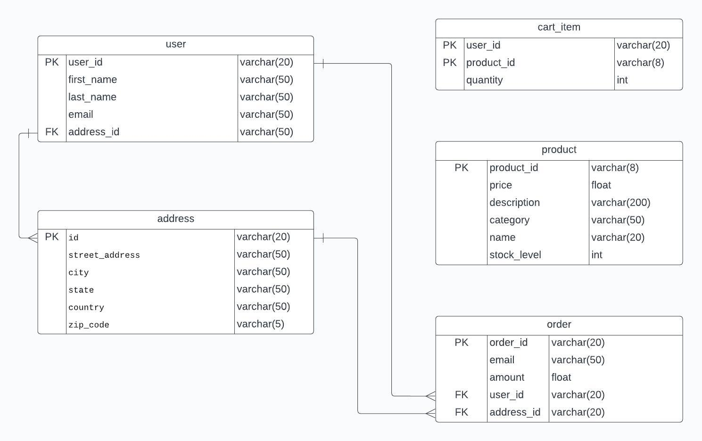

# Projects

## Database


## Services
### Cart Service

**Tasks:**
- Create cart service with database storage

```
curl -X 'GET' \
  'http://cart-service/cart/users/abcde' \
   -H 'accept: application/json'
   
curl -X 'POST' 'http://cart-service/cart/users/abcde' \
  -H 'accept: application/json' \
  -H 'content-type: application/json' \
  -d '{
  "product_id": "L9ECAV7KIM",
  "quantity": 8
}'
```
### Product Catalog Service

**Tasks:**
- Create Product Catalog Service with database storage

```
{
    "products": [
        {
            "id": "OLJCESPC7Z",
            "name": "Sunglasses",
            "description": "Add a modern touch to your outfits with these sleek aviator sunglasses.",
            "picture": "/static/img/products/sunglasses.jpg",
            "price": 19,
        },
        {
            "id": "66VCHSJNUP",
            "name": "Tank Top",
            "description": "Perfectly cropped cotton tank, with a scooped neckline.",
            "picture": "/static/img/products/tank-top.jpg",
            "price": 18,
        }
     ]
}
```
### Checkout Service

**Tasks:**
- Create Checkout Service

Input to the Checkout Service is a JSON object with the following structure:  
**Input**
```
curl -X 'POST' \
  'http://checkout-service/checkout' \
  -H 'accept: application/json' \
  -H 'Content-Type: application/json' \
  -d '{
  "user_id": "abcde",
  "address": {
    "street_address": "1600 Amp street",
    "city": "Mountain View",
    "state": "CA",
    "country": "USA",
    "zip_code": "94043"
  },
  "email": "someone@example.com",
  "credit_card": {
    "credit_card_number": "4432-8015-6251-0454",
    "credit_card_cvv": 672,
    "credit_card_expiration_year": 24,
    "credit_card_expiration_month": 1
  }
}'
```
#### SQL
```
CREATE TABLE "order" (
  "order_id" varchar(20),
  "email" varchar(50),
  "amount" float,
  PRIMARY KEY ("order_id")
);

```

**Tasks:**
The Checkout Service should read the user id and perform the following steps:
- Read the user's cart from the cart service and fetch the product id
- Read the product from the product catalog service to get the price
- Calculate the total price of the cart
- Generate a unique order id  
- Store the order in the database in the order table


### Sign up/Login Service Service
The signup service should allow a user to create/delete an account.
Upon signing up a user id is created in the user table, the
user signs up with email.

POST http://signup-service/register
{
  email: "someone@example.com",
}


**Future Task**
- Implement Shipping Service
- Implement Payment Service


### Payment Service
### Login Service
### Shipping Service
### Recommendation Service
